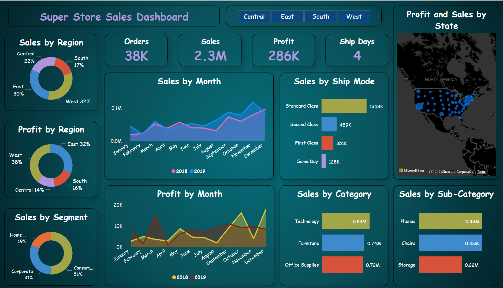

## **SuperStore Sales Dashboard: Driving Business Success Through Sales Data Analysis** 🚀

### **Industry Context** 🌟
The retail industry is very competitive, so stores need to boost sales, profits, and customer happiness. The SuperStore Sales Dashboard helps by giving important information about sales in different product categories, regions, and customer groups. This helps managers and executives make smart decisions to improve their business.

---

### **Objective** 🎯
The main goal of this dashboard is to analyze SuperStore sales data to uncover trends in revenue, profit margins, customer segments, and shipping efficiencies. The insights gained from this analysis are aimed to help stakeholders optimize product offerings, streamline operations, and improve profitability.

---

### **About the Data** 📊
The dataset for this dashboard includes detailed sales information for the SuperStore, covering metrics such as:

- **Category** 🛒
- **Sub-Category** 📦
- **Profit** 💰
- **Region** 🌍
- **Segment** 📈
- **Order ID** 🧾
- **Shipping Modes** 🚚
- **Order Volumes** 📉
- **Order Date** 📅
- **Ship Date** 🚛
- **State** 🗺️

---

### **Data Preprocessing** 🛠️
To ensure data accuracy and reliability, the following preprocessing steps were conducted:

1. **Data Cleaning**: Fixed missing values, removed duplicates, and ensured all data types were correct. 🔧

2. **Calculated Columns and Measures**: Added new metrics and calculations to enhance data analysis. 📈

3. **Filtering and Aggregation**: Filtered and summarized the data to analyze key metrics across different categories and segments. 📊

4. **Data Modeling**: Established relationships between data tables and defined hierarchies for deeper analysis. 🔗

5. **Data Validation**: Performed checks to ensure data accuracy and consistency. ✔️

---

### **Insights & Actionable Outcomes** 🔍

#### **Profitability Analysis** 💵
- **Overall Performance**:
  - The SuperStore achieved **total sales** of **$2.3M** with a **profit** of **$286K** from **38K** orders. 🎉

- **Regional Profit Distribution**:
  - The **West** region led with the highest profit at **38%**, followed by the **East** and **South** regions. The **Central** region trailed with only **14%** of the total profit. 🌍

---

#### **Sales Analysis** 📈
- **Segment-wise Sales**:
  - The **Consumer** segment was the largest contributor, accounting for **51%** of total sales, followed by **Corporate** (31%) and **Home Office** (19%). 🛒

- **Sales by Shipping Mode**:
  - **Standard Class** shipping was the most popular, generating **$1.358M** in sales, while **Same Day** delivery, despite being the least used, contributed **$128K**. 🚚

- **Sales by Category**:
  - **Technology** was the highest-grossing category, with **$0.84M** in sales, followed closely by **Furniture** and **Office Supplies**. 🖥️

- **Sales by Sub-Category**:
  - **Phones** was the top performer, with **$0.33M** in sales, followed closely by **Chairs** and **Storage**. 📱

---

#### **Monthly Trends** 📅
- **Sales by Month**:
  - Sales peaked in **November and December** each year, indicating a strong holiday sales period. 🎄

- **Profit by Month**:
  - **Profit margins** were highest during **November and December**, highlighting the impact of holiday promotions and effective inventory management. 📈

---

#### **State Analysis** 🗺️
- **Sales and Profit by State**:
  - **California** led with sales of **$500K** and a profit of **$76K**. **New York** followed with sales of **$300K** and a profit of **$74K**. 🏆

---

#### **Use Cases** 📊
- **Retail Managers** can leverage this dashboard to identify top-performing product categories and focus marketing efforts accordingly. 📈

- **Supply Chain Teams** can optimize shipping modes and manage inventory to align with sales trends, ensuring efficient operations during peak seasons. 🚚

- **Executives** can use regional sales and profit data to allocate resources effectively and target regions with growth potential. 🌍
